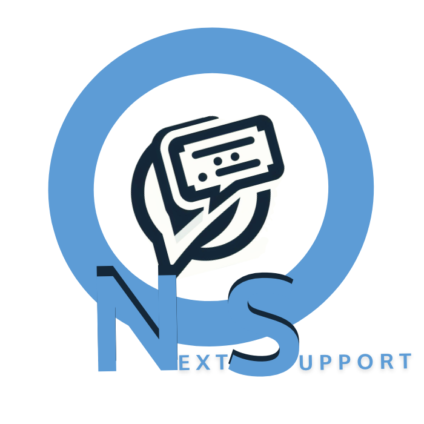

<a name="readme-top"></a>

<div align="center">

  
  <br/>

  <h3><b>NextSupport</b></h3>

</div>

<!-- TABLE OF CONTENTS -->

# 📗 Table of Contents

- [📖 About the Project](#about-project)
  - [🛠 Built With](#built-with)
    - [Tech Stack](#tech-stack)
    - [Key Features](#key-features)
- [💻 Getting Started](#getting-started)
  - [Prerequisites](#prerequisites)
  - [Setup](#setup)
  - [Install](#install)
  - [Usage](#usage)
  - [Run tests](#run-tests)
- [👥 Authors](#authors)
- [🔭 Future Features](#future-features)
- [🤝 Contributing](#contributing)
- [⭐️ Show your support](#support)
- [🙏 Acknowledgements](#acknowledgements)
- [❓ FAQ (OPTIONAL)](#faq)
- [📝 Attribution](#attribution)
- [📝 License](#license)

<!-- PROJECT DESCRIPTION -->

# 📖 NextSupport <a name="about-project"></a>

Next Support is a nextjs full stack application that enables users to signin | signup and create cases.

## 🛠 Built With <a name="built-with"></a>

### Tech Stack <a name="tech-stack"></a>


<details>
  <summary>Microsoft Fluent UI framework (v9)</summary>
  <ul>
    <li><a href="https://developer.microsoft.com/en-us/fluentui#/get-started/web">Microsoft Fluent UI framework (v9)</a></li>
  </ul>
</details>

<details>
  <summary>NextJs</summary>
  <ul>
    <li><a href="https://nextjs.org/docs/getting-started/">NextJs</a></li>
  </ul>
</details>

<details>
  <summary>Typescript</summary>
  <ul>
    <li><a href="https://www.typescriptlang.org/docs/">Typescript</a></li>
  </ul>
</details>


<details>
  <summary>NextAuth</summary>
  <ul>
    <li><a href="https://www.typescriptlang.org/docs/](https://next-auth.js.org/getting-started/introduction">NextAuth</a></li>
  </ul>
</details>


<!-- Features -->
## 🛠 Key Features <a name="key-features"></a>
### Features <a name="key-features"></a>

> Signup

> SignIn

> Create Cases

> View Cases


<p align="right">
(<a href="#readme-top">back to top</a>)</p>


<!-- GETTING STARTED -->

## 💻 Getting Started <a name="getting-started"></a>

To get a local copy of the project and run it, follow the following Steps and Prerequisites.

### Prerequisites

In order to run this project you need:

> Node js installed on your local machine

> A package manager such as npm, yarn or pnpm

> A code editor such as Visual Studio Code, Sublime Text, Atom, etc.

> A web browser such as Chrome, Firefox, Safari, etc.

> A terminal or command line interface

> A git client installed on your local machine

> A github account

### Setup

Clone this repository to your desired folder:


```sh
cd my-folder
git clone https://github.com/RileyManda/next-support.git
```


### Install

```sh
  cd next-support
```
Install dependencies:
```sh
  yarn
```

Generate your secret:
```sh
 openssl rand -base64 32
```

### Usage

To run the project, execute the following command:

```bash
yarn dev
```

Alternatively if using npm package manager:

```bash
npm run dev
```

If using pnpm package manager:

pnpm dev
# or
bun dev

### Run tests

To run tests, run the following command:

```sh
  yarn test
```


### Deployment

You can deploy this project using:

```sh
    yarn build
```

Then follow the deployment instructions for your preferred hosting platform.

<p align="right">(<a href="#readme-top">back to top</a>)</p>

<!-- AUTHORS -->

## 👥 Authors <a name="authors"></a>

👤 **RileyManda**

- GitHub: [@RileyManda](https://github.com/RileyManda)
- Twitter: [@rilecodez](https://twitter.com/rileycodez)
- LinkedIn: [rileymanda](https://www.linkedin.com/in/rileymanda/)


<p align="right">(<a href="#readme-top">back to top</a>)</p>

<!-- FUTURE FEATURES -->

## 🔭 Future Features <a name="future-features"></a>

> Improve UI component theme

> Add more user authentication options


<p align="right">(<a href="#readme-top">back to top</a>)</p>

<!-- CONTRIBUTING -->

## 🤝 Contributing <a name="contributing"></a>

Contributions, issues, and feature requests are welcome!

Feel free to check the [issues page](https://github.com/RileyManda/NextSupport/issues).

<p align="right">(<a href="#readme-top">back to top</a>)</p>

<!-- SUPPORT -->

<!-- SUPPORT -->
## <b>Show your support 🌟</b><a name="support"></a>

Thank you for taking the time to explore this project! Your support means a lot to me. If you find my project valuable and would like to contribute, here is one way you can support me:

 - <b>Star the project ⭐️</b>: Show your appreciation by starring this GitHub repository. It helps increase visibility and lets others know that the project is well-received.

 - <b>Fork the project 🍴 🎣</b>: If you're interested in making improvements or adding new features, feel free to fork the project. You can work on your own version and even submit pull requests to suggest changes.

 - <b>Share with others 🗺️</b>: Spread the word about this project. Share it on social media, mention it in relevant forums or communities, or recommend it to colleagues and friends who might find it useful.

<p align="right">(<a href="#readme-top">back to top</a>)</p>

<!-- ACKNOWLEDGEMENTS -->

## 🙏 Acknowledgments <a name="acknowledgements"></a>

I would like to express my gratitude to DataBalk for the opportunity to create this exciting and fun project.
Your contributions have been instrumental in the success of this project, and I'm thankful for the knowledge and resources you've added to my developer jourmey.


<p align="right">(<a href="#readme-top">back to top</a>)</p>

<!-- FAQ (optional) -->

## ❓ FAQ <a name="faq"></a>

- **Question_1**

  Do I have to use the vs code specifically?

  - Answer_1

    You can use any code editor of your choice. <br>

- **Question_2**

  Where can I download node JS for installation?

  - Answer_2

  Node.js® is a JavaScript runtime built on Chrome's V8 JavaScript engine.
  It can be downloaded [here](https://nodejs.org/en).


<p align="right">(<a href="#readme-top">back to top</a>)</p>

<!-- ATTRIBUTION -->

## 👥 Attribution <a name="attribution"></a>
- Original logo design template from: [Svgrepo](https://www.svgrepo.com/)

<!-- LICENSE -->

## 📝 License <a name="license"></a>

[](./LICENSE)

<p align="right">(<a href="#readme-top">back to top</a>)</p>
